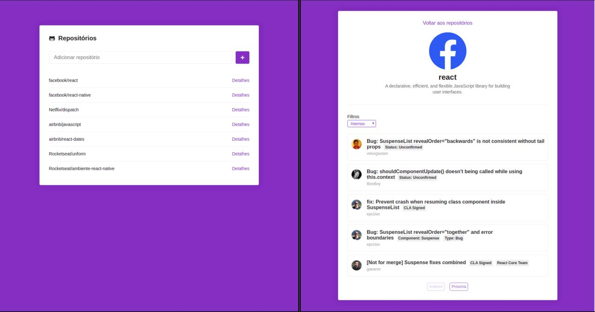

# Lista de Repositórios

A aplicação lista repositórios do gitHub cadatrados na aplicação. Para cadastrar um repositório basta infomar nome_do_proprietário/nome_do_repositório no input na página inicial e clicar em '+'.

Clicando em detalhes é possível ver a listagem de issues do reporitório selecionado.




## Instalação

Após clonar o repositório, dentro da pasta criada, execute o comando

```bash
yarn
```

## Execução

Dentro da pasta do projeto execute

```bash
yarn start
```

## Licença
[MIT](https://choosealicense.com/licenses/mit/)
